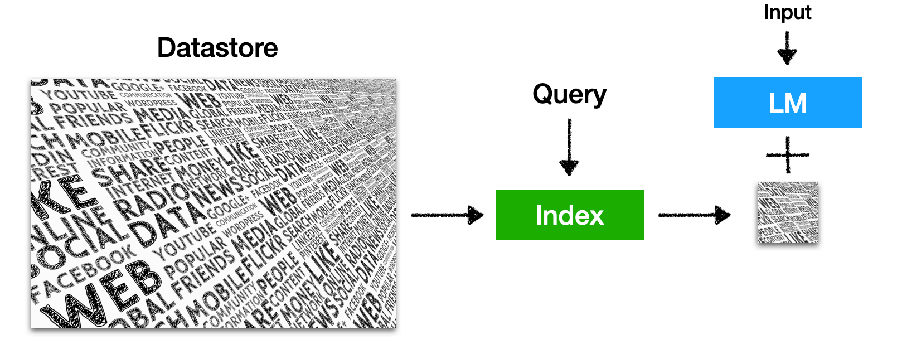

# [ACL 2023 Tutorial:Retrieval-based Language Models and Applications](https://acl2023-retrieval-lm.github.io/)

Akari Asai, Sewon Min, Zexuan Zhong, Danqi Chen

这里主要中文总结本教程中的一些重点内容

讲者说明：
本教程是最前沿的，与参数化llm相比，我们还远远不能理解如何最好地开发基于检索的lm，这个教程主要分享：
* 现有研究的分类和关键见解
* 我们对当前挑战和开放问题的看法

## 1. Introduction
1. 什么是Retrieval-based language models (LMs)？
Retrieval-based LMs = Retrieval + LMs

语言模型从外部数据存储中进行检索（至少在推理期间）这样的模型也被称为半参数模型和非参数模型（semiparametric 
and non-parametric models）

2. The age of large language models (LLMs)：主要介绍目前大语言模型的一些特点
   * Transformers-based, fully parametric 
   * Trained on next-token prediction tasks (+ RLHF;)
   * Model size ↑, data size↑
  
3. Retrieval for knowledge-intensive NLP tasks 对知识密集型任务的检索
   
   **Representative tasks**: open-domain QA, fact checking, entity linking...

   LM推动了大量关于密集检索的更好算法的研究，例如，DPR，ColBERT,ANCE,Contriever，..

4. **Why** retrieval-based LMs?
   
  	* LLMs can’t memorize all (long-tail) knowledge in their parameters 大模型的参数对知识的记忆有限
	* LLMs’ knowledge is easily outdated and hard to update 大模型的知识容易过时，难以更新--**现有的知识编辑方法仍然是不可扩展的**（研究方向！）而数据存储可以很容易地更新和扩展——甚至不需要重新训练模型
	* LLMs’ output is challenging to interpret and verify 大模型的输出难以验证和解释--从检索结果中更新知识来源可以获得更好的解释性和控制性（Generating text with citations，like newbing）
	* LLMs are shown to easily leak private training data 大模型容易泄漏私有训练数据 ，所以可以通过将私人数据存储在数据存储器中，从而对其进行个性化处理（而不是直接参与模型参数训练？）
	* LLMs are *large* and expensive to train and run 大模型训练和运行成本高，而数据存储器可以在推理期间进行检索，因此可以**减少模型的大小和成本** --Long-term goal: can we possibly reduce the training and inference costs, and scale down the size of LLMs?

## 2. Definition & Preliminaries

1. A Retrieval-based LM: Definition - A language model (LM) that usesan external datastore at test time  在测试期间使用外部数据存储的语言模型
2.
	A language model (LM): Categories
	 
	 这里有一个问题是为什么Decoder-only模型几乎成为了现在LLM的主流架构？