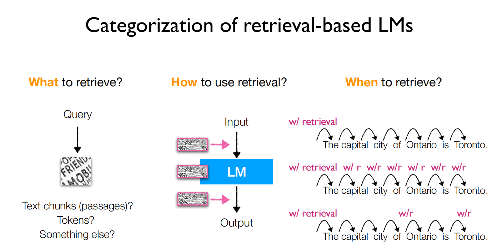
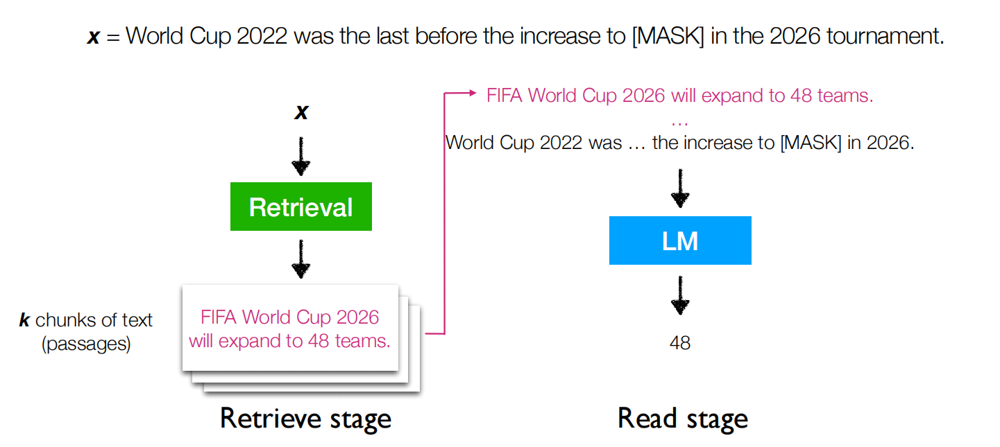
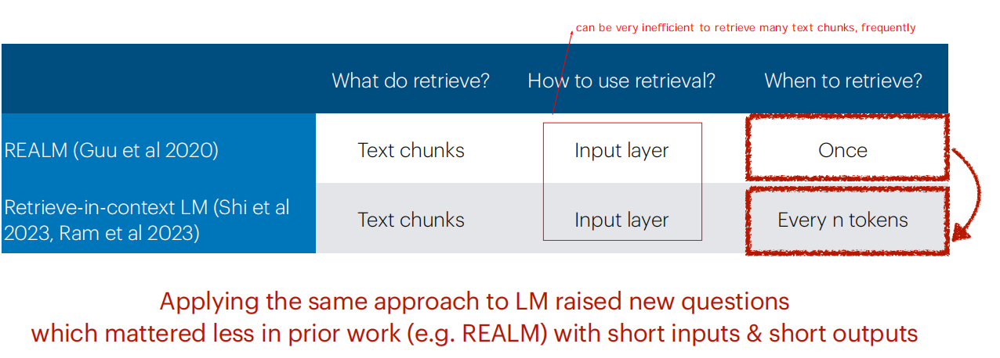
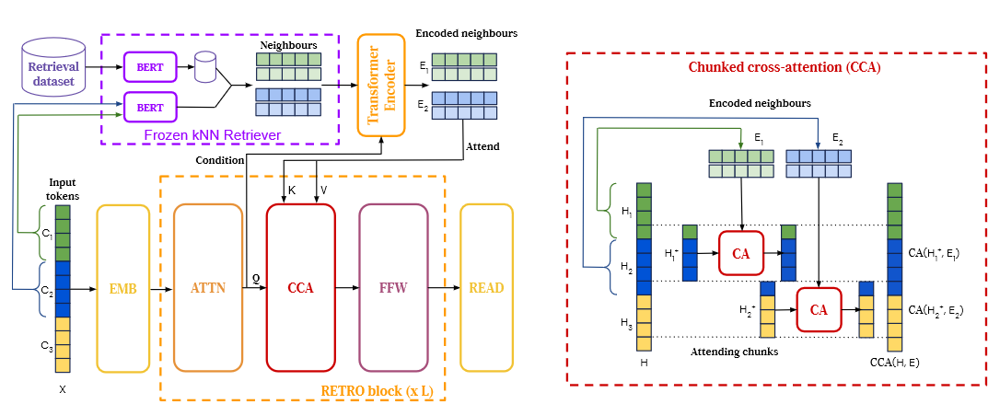
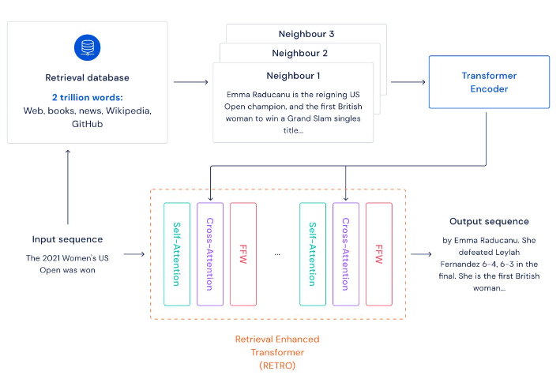
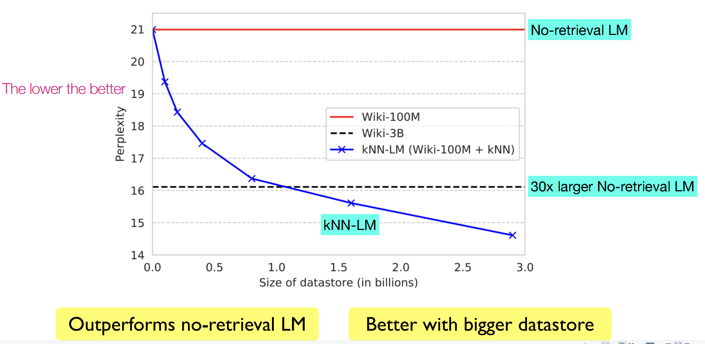
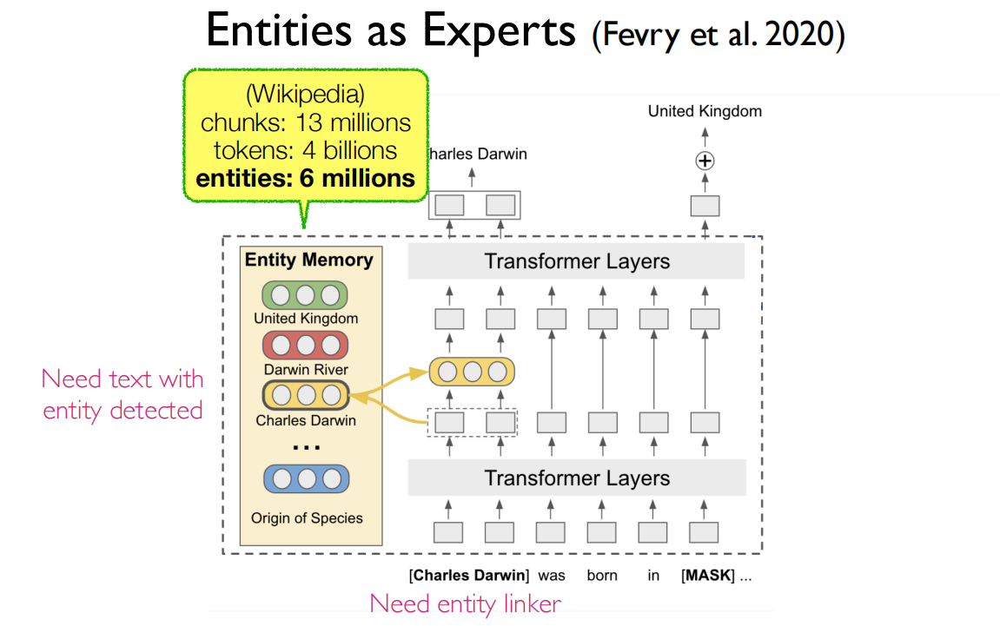
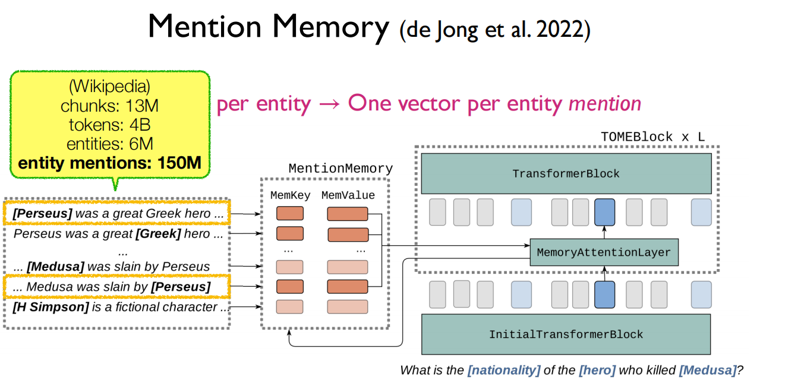

# 🧎♀ ACL 2023 Tutorial: Retrieval-based Language Models and Applications

这里主要中文总结本教程中的一些重点内容

**讲者说明**： 本教程是最前沿的，与参数化llm相比，我们还远远不能理解如何最好地开发基于检索的lm，这个教程主要分享：

* 现有研究的分类和关键见解
* 我们对当前挑战和开放问题的看法

## 1. Introduction

**1. 什么是Retrieval-based language models (LMs)？**

Retrieval-based LMs = Retrieval + LMs 语言模型从外部数据存储中进行检索（至少在推理期间）

<figure><figcaption></figcaption></figure>

这样的模型也被称为半参数模型和非参数模型（semiparametric and non-parametric models）

**2. The age of large language models (LLMs)：主要介绍目前大语言模型的一些特点**

* Transformers-based, fully parametric
* Trained on next-token prediction tasks (+ RLHF;)
* Model size ↑, data size↑

**3. Retrieval for knowledge-intensive NLP tasks** 对知识密集型任务的检索

**Representative tasks**: open-domain QA, fact-checking, entity linking...

LM推动了大量关于密集检索的更好算法的研究，例如，DPR，ColBERT,ANCE,Contriever，..

**4. Why** retrieval-based LMs?

* LLMs can’t memorize all (long-tail) knowledge in their parameters 大模型的参数对知识的记忆有限
* LLMs’ knowledge is easily outdated and hard to update 大模型的知识容易过时，难以更新----现有的知识编辑方法仍然是**不可扩展**的（研究方向！）而数据存储可以很容易地更新和扩展——甚至不需要重新训练模型
* LLMs’ output is challenging to interpret and verify 大模型的输出难以验证和解释--从检索结果中更新知识来源可以获得更好的解释性和控制性（Generating text with citations，like newbing）
* LLMs are shown to easily leak private training data **大模型容易泄漏私有训练数据** ，所以可以通过将私人数据存储在数据存储器中，从而对其进行个性化处理（而不是直接参与模型参数训练？）
* LLMs are large and expensive to train and run 大模型训练和运行成本高，而数据存储器可以在推理期间进行检索，因此可以**减少模型的大小和成本** --Long-term goal: can we possibly reduce the training and inference costs, and scale down the size of LLMs?

## 2. Definition & Preliminaries

**1. A Retrieval-based LM: Definition** - A language model (LM) that usesan external datastore at test time 在测试期间使用外部数据存储的语言模型&#x20;

**2. A language model (LM): Categories**

<figure><figcaption></figcaption></figure>

这里有一个问题是**为什么Decoder-only模型几乎成为了现在LLM的主流架构**？&#x20;

参考博客：

[https://kexue.fm/archives/9529](https://kexue.fm/archives/9529)

[https://www.zhihu.com/question/588325646](https://www.zhihu.com/question/588325646)

主要观点: 任何NLP任务都可以分解为“输入”跟“输出”两部分，我们可以把处理“输入”的模型叫做Encoder，生成“输出”的模型叫做Decoder，那么所有任务都可以从“Encoder-Decoder”的视角来理解，而不同模型之间的差距在于Encoder、Decoder的注意力模式以及是否共享参数,比如:

| Model  | Encoder 注意力  | Dncoder 注意力 | 是否共享参数  |
| ------ | ------------ | ----------- | ------- |
| GPT    | 单向           | 单向          | 是       |
| UniLM  | 双向           | 单向          | 是       |
| T5     | 双向           | 单向          | 否       |


```markdown

这里的GPT就是Decoder-only的代表作；UniLM则是跟GPT相似的Decoder架构，但它是混合的注意力模式；T5则是Encoder-Decoder架构的代表作，主要是Google比较感兴趣。

1. GPT和UniLM的对比实验，结果说明：“输入部分的注意力改为双向不会带来收益，Encoder-Decoder架构的优势很可能只是源于参数翻倍。”

2. 低秩问题：Attention矩阵一般是由一个低秩分解的矩阵加softmax而来，具体来说是一个n×d的矩阵与d×n的矩阵相乘后再加softmax（n≫d），这种形式的Attention的矩阵因为低秩问题而带来表达能力的下降，具体分析可以参考《Attention is Not All You Need: Pure Attention Loses Rank Doubly Exponentially with Depth》。而Decoder-only架构的Attention矩阵是一个下三角阵，注意三角阵的行列式等于它对角线元素之积，由于softmax的存在，对角线必然都是正数，所以它的行列式必然是正数，即Decoder-only架构的Attention矩阵一定是满秩的，满秩意味着理论上有更强的表达能力，也就是说， Decoder-only架构的Attention矩阵在理论上具有更强的表达能力，改为双向注意力反而会变得不足。（可以参考线性attention相关内容：《Attention is Not All You Need: Pure Attention Loses Rank Doubly Exponentially with Depth》&《Transformer升级之路》）

3. 《Attention is Not All You Need: Pure Attention Loses Rank Doubly Exponentially with Depth》
论文最主要的一个结论是decoder-only模型在没有任何tuning数据的情况下、zero-shot表现最好，而encoder-decoder则需要在一定量的标注数据上做multitask finetuning才能激发最佳性能。而目前的Large LM的训练范式还是在大规模语料上做自监督学习，很显然，Zero-Shot性能更好的decoder-only架构才能更好地利用这些无标注数据。此外，Instruct GPT在自监督学习外还引入了RLHF作辅助学习。RLHF本身也不需要人工提供任务特定的标注数据，仅需要在LLM生成的结果上作排序。虽然目前没有太多有关RLHF + encoder-decoder的相关实验，直觉上RLHF带来的提升可能还是不如multitask finetuning，毕竟前者本质只是ranking、引入监督信号没有后者强。即，encoder-decoder在multitask finetuning上的优势在大参数量时被LLM的推理能力给拉平了。

```


链接阅读：

[Transformer升级之路](https://spaces.ac.cn/archives/8338)

[Attention is Not All You Need: Pure Attention Loses Rank Doubly Exponentially with Depth](https://arxiv.org/abs/2103.03404)

&#x20;**3. A language model (LM): Prompting**

即通过不同的prompt让llm完成不同的任务

**4. A language model (LM): Often evaluated with**&#x20;

给出评价指标：1. Perplexity  2. Downstream accuracy (Zero-shot or few-shot in-context learning,or fine-tuning) 会在第五节详细介绍

一个问题：**为什么要用perplexity来作为本课程的主要指标**

“在比较参数化的语言模型时，困惑度（PPL）经常被用到。但困惑度的改善能否转化为下游应用仍然是一个研究问题，现已有研究表明，<mark style="background-color:yellow;">困惑度与下游任务（尤其是生成任务）有很好的相关性，并且困惑度通常可提供非常稳定的结果，它可以在大规模评估数据上进行评估</mark>**。**(相对于下游任务来说，评估数据是没有标签的，而下游任务可能会受到提示的敏感性和缺乏大规模标记数据的影响，从而导致结果不稳定）。”

**5. Inference: Datastore**

<figure><figcaption></figcaption></figure>

**6. Inference: Index**

目标：在数据存储中找到与查询最相似的一小部分元素

**sim**：a similarity score between two pieces of text 下面是similarity score的一些例子

<figure><figcaption></figcaption></figure>

index：给定query，通过fast nearest neighbor search（这也是一个研究方向-如何更加快快速和准确），输出sim最大的k个元素

相关software: FAISS, Distributed FAISS, SCaNN, etc…

参考：[Faiss](https://github.com/facebookresearch/faiss/wiki)

## 3. Retrieval-based LM: Architecture

**1. Categorization of retrieval-based LMs**



**2. Roadmap**

根据 检索什么，如何使用检索，在什么时候检索将最近的研究总结展示在下面的路线图：


### [REALM (Guu et al 2020)](https://arxiv.org/abs/2002.08909)--10 Feb 2020

本段开始介绍第一个结构 REALM：Retrieval-Augmented Language Model Pre-Training--检索增强的预训练语言模型

<figure><figcaption></figcaption></figure>

知乎上一些阅读笔记：

* [https://zhuanlan.zhihu.com/p/111255083](https://zhuanlan.zhihu.com/p/111255083)
* [https://zhuanlan.zhihu.com/p/360635601](https://zhuanlan.zhihu.com/p/360635601)

**动机**：预训练语言模型能够从无监督文本语料中学习到很多公共知识。然而，这些知识存储在参数中，有以下两个缺点：1. 这些知识是隐式的，使用时难以解释模型储存、使用的知识；2. 模型学习到的知识的量级和模型大小（参数量）相关，因此为了学习到更多的知识，需要扩充模型大小。

**预训练阶段的流程**：1. 从预训练语料中采样 ，并将部分token mask（the \[MASK] at the top of the pyramid）；2. 通过检索模块，根据样本 去外部知识库（如维基百科文档）中检索能够帮助恢复mask token的文档 （The pyramidion on top allows for lessmaterial higher up the pyramid）；3. 使用样本 x 内部的信息，以及检索到的文档 中的信息，共同预测被mask掉的token（pyramidion）；

**模型结构**：模型的pre-training和fine-tuning都建模为retrieve-then-predict的过程，作者将$z$ 视为一个隐变量，将最后的任务目标$y|x)$建模为对于所有潜在文档 $$z$$ 的边缘概率：&#x20;

$$
p(y|x)=\sum_{z\in\mathcal{Z}}p(y|z,x)p(z|x)
$$

**两个部分**：the neural knowledge retriever(神经知识检索器), -> $$p(z | x)$$, and the knowledge-augmented encoder(知识增强的encoder), -> $$p(y | z, x)$$.&#x20;

<figure><figcaption></figcaption></figure>

<figure><figcaption></figcaption></figure>

在预训练阶段，任务为MLM；在fine-tune阶段，任务为Open-domain QA

**训练细节**：针对数据量较大的解决办法--**pretraining阶段使用Maximum Inner Product Search（最大内积搜索--即内积空间下的KNN，MIPS）的算法来找到top-k个最相关文档**，为了避免一直刷新MIPS索引造成耗时严重，每隔若干step才刷新一次MIPS索引（该索引仅用来选择top-k个文档，而在每一步训练[梯度反传](acl2023-retrieval-lm.md#梯度反传)的时候，仍然使用的是最新的retreiver的参数）。**在fine-tune阶段，MIPS索引仅在一开始建立一次**（使用预训练的retriever参数），之后便不再更新。作者认为在预训练阶段检索器就已经学习到了足够好的文档相关性表征，但作者认为如果同样在fine-tune阶段迭代更新MIPS索引的话，效果可能会更好。

**trick**：1. Salient span masking（SSM）：即在MLM预训练阶段，遮盖关键的实体/数字，而不是随机token；2. null document：部分MLM样本不需要外部文档支持；3. 避免信息泄漏：当MLM的训练语料和检索语料有重叠时，避免直接搜索到样本x的原文；4. 检索器的初始化、冷启动问题：如果一开始随机初始化检索器，那么文档将会大概率是完全无关的，模型得不到有效的梯度；为了避免这个问题，作者使用Inverse Cloze Test（ICT逆完形填空）任务来初始化训练检索器。

**相关工作总结**： REALM and subsequent work

* **REALM (Guu et al 2020)**: MLM followed by fine-tuning, focusing on open-domain QA
* **DPR (Karpukhin et al 2020)**: Pipeline training instead of joint training, focusing on open-domain QA (no explicit language modeling)
* **RAG (Lewis et al 2020)**: “Generative” instead of “masked language modeling”, focusing on open-domain QA & knowledge intensive tasks (no explicit language modeling)
* **Atlas (Izcard et al 2022)**: Combine RAG with retrieval-based language model pre-training based on the encoder-decoder architecture (more to come in Section 4), focusing on open-domain QA & knowledge intensive tasks
* Papers that follow this approach focusing on LM perplexity have come out quite recently (Shi et al. 2023, Ram et al. 2023) ：**Ram et al. 2023**. “In-Context Retrieval-Augmented Language Models”&**Shi et al. 2023**.“REPLUG: Retrieval-Augmented Black-Box Language Models

### Retrieval-in-context LM

**相关论文：**

[In-Context Retrieval-Augmented Language Models](https://arxiv.org/abs/2302.00083)

在上面这篇论文中有一些实验结论:1. Retrieval helps overall sizes of LMs 2. A shorter prefix (more recent tokens) as a query helps 3. Retrieving more frequently helps(但是会消耗更多的推理时间成本)

[REPLUG: Retrieval-Augmented Black-Box Language Models](https://arxiv.org/abs/2301.12652)



### [RETRO (Borgeaud et al. 2021)-以小25倍参数量媲美GPT-3的检索增强自回归语言模型](https://arxiv.org/abs/2112.04426)

“Incorporation in the “intermediate layer” instead of the “input” layer → designed for many chunks, frequently, more efficiently”

RETRO(Retrieval-Enhanced Transformer )-- improving language models through **explicit memory** at unprecedented scale

合并到中间层而不是输入层 + 数据规模的增加

相关笔记：

[https://zhuanlan.zhihu.com/p/475346411 ](https://zhuanlan.zhihu.com/p/475346411)

[https://www.cnblogs.com/Matrix\_Yao/p/16480698.html](https://www.cnblogs.com/Matrix\_Yao/p/16480698.html)


**动机**：模型参数↑ 模型数据量↑ 容易发生数据集难理解、增加模型偏差等一系列问题，为了解决这个问题，DeepMind团队研发一种<mark style="background-color:yellow;">带有互联网规模检索的高效预训练模型</mark>。使用 RETRO，<mark style="background-color:yellow;">模型不仅限于训练期间看到的数据，它还可以通过检索机制访问整个训练数据集。</mark>与具有相同数量参数的标准 Transformer 相比，这会带来显着的性能提升。

**数据集**：[MassiveText数据集](https://paperswithcode.com/dataset/massivetext)(来自gopher模型论文)

提出了一种**避免数泄露的方法**：检索的过程就能直接访问训练集所以防止数据泄露很重要-为此论文作者提出了一种衡量测试文档与训练集接近程度的评估方式[Deduplicating Training Data Makes Language Models Better](https://arxiv.org/abs/2107.06499)

**模型结构** RETRO模型架构由一个编码器堆栈（处理近邻）和一个解码器堆栈（处理输入）组成： 编码器堆栈由标准的 Transformer 编码器块组成；解码器堆栈包含了Transformer解码器块和RETRO 解码器块（ATTN + **Chunked cross attention (CCA)** + FFNN（Feed-forward neural network））。

* [ ] _这里标注和补充_



简化流程：&#x20;

<figure><figcaption></figcaption></figure>

对比：

<figure><figcaption></figcaption></figure>

**思考**：除了检索split成chunks，还可以怎么处理db中的数据？

↓

### [kNN-LM (Khandelwal et al. 2020) -- Generalization through Memorization: Nearest Neighbor Language Models](https://arxiv.org/abs/1911.00172)

提出kNN-LMs，把语义编码特征向量的k最近邻和一般的语言模型结合从而显著提高语言模型的效果

* “A different way of using retrieval, where the LM outputs a nonparametric distribution over every token in the data.” 另一种使用检索的方法，其中LM在数据中的每个标记上输出一个非参数分布。
* “Can be seen as an incorporation in the ‘output’ layer” 可以看做是在输出层的一个合并

**动机**：语言模型（Language Model, LM）指的是利用链式法则给出一个句子的概率，主要要解决两个问题：（1）得到上文表示；（2）用上文表示预测下一个token。这两个问题一般使用一个autoregressive模型解决。使用AR模型去进行语言建模的一个普遍问题是：**难以充分建立长距离依赖**。由此出发，本文提出通过计算上文表示的k最近邻去结合语言模型从而**更好地捕捉上下文之间的语义关系**。

**模型结构：**

<figure><figcaption></figcaption></figure>

具体的流程可以去看slide讲的很清楚

**模型实验结果:**

&#x20;&#x20;

<figure><figcaption></figcaption></figure>

<figure><figcaption></figcaption></figure>

Can use in-domain datastore even if parameters were not trained in-domain

**对比总结**：

KNN-LM的优点:更细粒度；可以更好地处理罕见的模式&域外数据，可以非常高效（因为KNN搜索很快）

缺点: <mark style="background-color:yellow;">输入和检索结果之间没有交叉注意；Datastore消耗比较大</mark>&#x20;

<figure><figcaption></figcaption></figure>

**思考**: 在when to retrieve中，every n tokens和every tokens是否可以去做 adaptive ？ ↓

### Adaptive retrieval for efficiency

分为两类：Adaptive retrieval of **text chunks** (following retrieve-in-context)；Adaptive retrieval of **tokens** (following kNN-LM)

#### [Active Retrieval Augmented Generation--Forward-Looking Active REtrieval augmented generation(FLARE)](https://arxiv.org/abs/2305.06983)

**动机和概述**：大多数现有的检索增强型语言模型都采用retrieve-and-generate设置，根据query进行一次信息检索。然而，在涉及生成长文本的更一般场景中，**在整个生成过程中不断收集信息**至关重要。过去已经有一些在生成输出时多次检索信息的努力，这些努力大多使用先前的上下文作为查询以固定的时间间隔检索文档。在这项工作中，**我们提供了主动检索增强生成**的概括视图，**即在生成过程中主动决定何时检索以及检索什么内容的方法**。我们提出了前瞻性主动检索增强生成（FLARE），这是一种通用的检索增强生成方法，它迭代地使用对即将到来的句子的预测来预测未来的内容，然后如果它包含低可信度令牌，则将其用作查询来检索相关文档以重新生成句子。

由长文本生成任务引出：**一次检索并不能满足需要**，与人类在创建论文或书籍等内容时逐渐收集信息的方式类似，使用 LM 进行长格式生成需要在整个生成过程中收集多种知识。 本文采取的方法是通过生成临时的下一个句子，将其作为检索相关文档的查询，然后根据检索到的文档重新生成下一个句子来预测未来。

FLARE迭代生成一个临时的下一个句子，如果它包含low-probability tokens，则将其用作检索相关文档的查询，并重新生成下一个句子句子直到结束。

**思考**：什么是<mark style="color:green;">low-probability tokens</mark> 如何界定


详细流程参考slides

#### Adaptive retrieval of tokens -Judge necessity-- [Efficient Nearest Neighbor Language Models](https://arxiv.org/abs/2109.04212)

<figure><figcaption></figcaption></figure>

#### Adaptive retrieval of tokens Use local info -- RETOMATON -- [Neuro-Symbolic Language Modeling with Automaton-augmented Retrieval](https://arxiv.org/abs/2201.12431)


**总结**：

&#x20;

<figure><figcaption></figcaption></figure>

思考: What else beyond text chunks and tokens to retrieve? ↓

### 实体专家模型

#### [Entities as Experts:Entities as Experts: Sparse Memory Access with Entity Supervision](https://arxiv.org/abs/2004.07202)

Introduce a new model—Entities as Experts (EAE)that can access distinct memories of the entities mentioned in a piece of text . 提出“实体专家”模型，可以访问文本中提到的实体的不同memories，与其他将实体特定知识注入序列模型的努力不同，本模型从文本中学习实体表示以及所有其他模型参数。

 上图可与看到，传统的Transformer需要根据“Charles”和“Darwin”这两个词构建 Charles Darwin 的内部表示，这两个词都可以也指不同的实体，例如查尔斯河或达尔文市。相反，EAE 可以访问“查尔斯·达尔文”的专用表示，它是先前提到过该实体的所有上下文的记忆。



#### 从每个实体一个向量到每个实体提及一个向量的转变--[Mention Memory:incorporating textual knowledge into Transformers through entity mention attention](https://arxiv.org/abs/2110.06176)通过实体提及注意力将文本知识融入transformer中

**摘要翻译**：

诸如开放域问答之类的自然语言理解任务通常需要从多个来源检索和吸收事实信息。我们建议通过**将大型文本语料库的半参数表示集成到 Transformer 模型中作为事实知识的来源来解决这个问题。**

具体来说，我们的方法用“提及记忆”来表示知识，“提及记忆”是语料库中提及的每个实体的密集向量表示表。所提出的模型 - TOME - 是一个 Transformer，它通过内部记忆层访问信息，其中输入段落中提及的每个实体都涉及提及记忆。这种方法可以在单个 Transformer 模型中对许多不同的信息源进行综合和推理。在使用 1.5 亿条维基百科提及的内存进行的实验中，TOME 在多个开放领域知识密集型任务上取得了出色的性能，包括声明验证基准 HoVer 和 FEVER 以及多个基于实体的 QA 基准。我们还表明，该模型在没有任何直接监督的情况下学会了关注informative mentions。最后，我们证明该模型可以通过更新内存而无需重新训练来推广到新的看不见的实体。



#### **总结：**


优势：对于以实体为中心的任务很有效&空间高效

劣势：需要额外的实体检测

上面所有的模型都是基于外部文本的，还有其他方法吗？↓

### Retrieval for long-range LM

#### [Wu et al. 2022. Memorizing Transformers (Figure source)](https://arxiv.org/abs/2203.08913)

语言模型通常需要进行训练或微调才能获取新知识，这涉及更新其权重。相反，我们设想语言模型可以在推理时简单地读取和记忆新数据，从而立即获取新知识。在这项工作中，我们扩展了语言模型，使其能够记住过去输入的内部表示。我们证明，对最近（键、值）对的不可微记忆进行近似 kNN 查找可以改进跨各种基准和任务的语言建模，包括通用网络文本 (C4)、数学论文 (arXiv)、书籍 (PG-19)、代码（Github），以及形式定理（Isabelle）。我们表明，当我们将内存大小增加到 262K 令牌时，性能会稳步提高。在包括代码和数学在内的基准测试中，我们发现该模型能够在测试期间使用新定义的函数和定理。(基于KNN去做检索)

对长序列的注意力作为快速学习的一种形式也很有用。以权重矩阵形式存储的事实和信息必须经过数十万个训练步骤缓慢训练。然而，通过使用注意力，模型可以通过将事实（例如函数定义）作为（键，值）对存储在长期记忆中来简单地记住它们，然后通过创建关注它们的查询来检索这些事实。在这种情况下，注意力充当信息检索的一种形式，允许模型查找它以前见过的事实。


↑扩展 Transformer 来访问先前看到的子序列的（键，值）对。

**Bertsch** et al. 2023. Unlimiformer: Long-Range Transformers with Unlimited Length Input

## 附录：概念补充

### 梯度反传

其实就是梯度下降和反向传播 参考：[https://atcold.github.io/pytorch-Deep-Learning/zh/week02/02-1/](https://atcold.github.io/pytorch-Deep-Learning/zh/week02/02-1/)

### 梯度反转

用于领域自适应 参考： [https://zhuanlan.zhihu.com/p/75470256](https://zhuanlan.zhihu.com/p/75470256)
