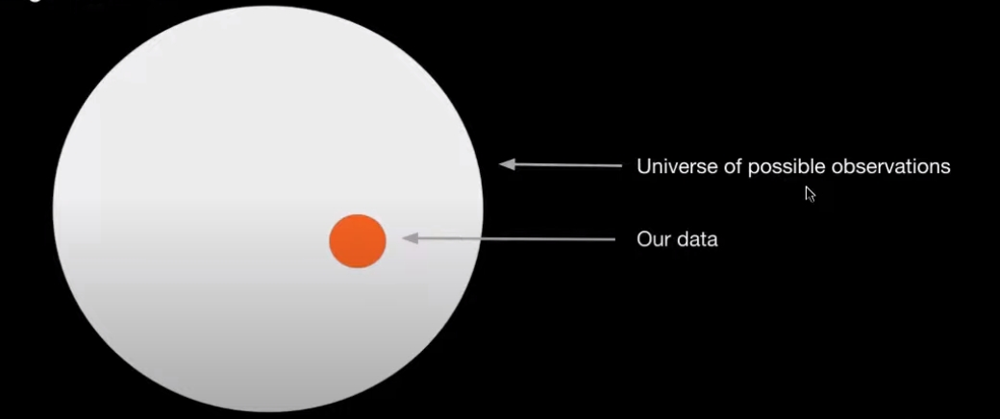

# 🧠 Compressing for AGI

相关解读：[https://zhuanlan.zhihu.com/p/619511222](https://zhuanlan.zhihu.com/p/619511222)

原视频：[https://www.youtube.com/watch?v=dO4TPJkeaaU\&t=161s](https://www.youtube.com/watch?v=dO4TPJkeaaU\&t=161s)

## Theme of talk

* Think deeply about the <mark style="background-color:red;">training objective of foundation models</mark>
* <mark style="background-color:red;">What are we doing , why dose it make sense, and what are the limitations?</mark>

## Takeaways

* seek the minimum description length to solve perception
* Generative models are lossless compressors
* <mark style="background-color:green;">Large language models are state-of-the-art lossless text compressors(?!)</mark>
* Current limitation of thr apporach

## Minimum Description Length&#x20;

### ...and why it relates to perception

We want to deepest understanding of our observations

ones that generalize

<figure><figcaption></figcaption></figure>

