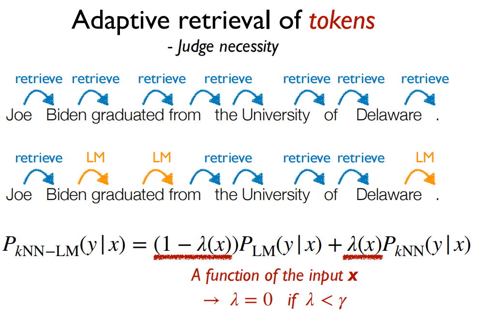

# 🌊 百川大模型



## 概述

发布团队：百川智能

家族：llama

能否商用：能

成员：[baichuan-7B(官方目前没有发布chat版本)](https://github.com/baichuan-inc/Baichuan-7B) / [baichuan-13B](https://github.com/baichuan-inc/Baichuan-13B) / [baichuan13B-chat](https://huggingface.co/baichuan-inc/Baichuan-13B-Chat)

基于Transformer结构，在大约1.2万亿tokens上训练的70亿参数模型，支持中英双语，上下文窗口长度为**4096**

## 数据（数据暂未开源）

处理流程：

<figure><figcaption></figcaption></figure>

* 开源的中英文数据+自行抓取的中文互联网数据+高质量知识性数据。
* 数据过滤：参考相关数据工作，频率和质量是数据处理环节重点考虑的两个维度。基于启发式规则[（heuristic rules](https://en.wikipedia.org/wiki/Heuristic\_\(computer\_science\))）和质量模型打分，对原始数据集进行篇章和句子粒度的过滤。在全量数据上，利用[局部敏感哈希](https://zhuanlan.zhihu.com/p/225949044)方法，对篇章和句子粒度做滤重。
* 语种配比：经过不断的调整和多轮测试，最终确认了一个在下游任务上表现最好的中英文配比。
* 数据类别配比：使用了一个基于自动学习的数据权重策略，对不同类别的数据进行配比。

## **分词**&#x20;

使用SentencePiece中的Byte-PairEncoding(BPE)作为分词算法，并且进行了以下的优化：

* 使用2000万条以中英为主的多语言语料训练分词模型，提升对于中文的压缩率。
* 对于数学领域，参考了LLaMA和Galactica中的方案，对数字的每一位单独分开，避免出现数字不一致的问题，对于提升数学能力有重要帮助。
* 对于罕见字词（如特殊符号等），支持UTF-8characters的byte编码，因此做到未知字词的全覆盖，词表大小达到6.4万。
* 对中文的压缩率比较高（<mark style="background-color:red;">？压缩率Compress Rate咋算的？？？？</mark>）

|     Model     | Baichuan-7B |  LLaMA | Falcon | mpt-7B | ChatGLM | moss-moon-003 |
| :-----------: | :---------: | :----: | :----: | :----: | :-----: | :-----------: |
| Compress Rate |    0.737    |  1.312 |  1.049 |  1.206 |  0.631  |     0.659     |
|   Vocab Size  |    64,000   | 32,000 | 65,024 | 50,254 | 130,344 |    106,029    |

## 模型结构

基于transformer 采用了和llama一样的模型设计

<figure><figcaption></figcaption></figure>

* **Position Embedding**：采用 [rotary-embedding](https://arxiv.org/abs/2104.09864)，是现阶段被大多数模型采用的位置编码方案，具有很好的外推性。
* **激活层 Feedforward Layer**：采用SwiGLU，Feedforward变化为(8/3)倍的隐含层大小，即11008。
* **Layer Normalization**: 基于[RMSNorm](https://arxiv.org/abs/1910.07467)的Pre-Normalization。

具体参数：

| 模型名称         | 隐藏层维度 |  层数 | 注意力头数 |  词表大小  |      总参数量      | 训练数据（tokens） |                    位置编码                   |  最大长度 |
| ------------ | :---: | :-: | :---: | :----: | :------------: | :----------: | :---------------------------------------: | :---: |
| Baichuan-7B  | 4,096 |  32 |   32  | 64,000 |  7,000,559,616 |    1.2 万亿    |  [RoPE](https://arxiv.org/abs/2104.09864) | 4,096 |
| Baichuan-13B | 5,120 |  40 |   40  | 64,000 | 13,264,901,120 |    1.4 万亿    | [ALiBi](https://arxiv.org/abs/2108.12409) | 4,096 |

“在原本的 LLaMA 框架上进行诸多修改以提升训练时的吞吐，具体包括：

1. 算子优化技术：采用更高效算子，如 Flash-Attention，NVIDIA apex 的 RMSNorm 等。
2. 算子切分技术：将部分计算算子进行切分，减小内存峰值。
3. 混合精度技术：降低在不损失模型精度的情况下加速计算过程。
4. 训练容灾技术：训练平台和训练框架联合优化，IaaS + PaaS 实现分钟级的故障定位和任务恢复。
5. 通信优化技术，具体包括：
   1. 采用拓扑感知的集合通信算法，避免网络拥塞问题，提高通信效率。
   2. 根据卡数自适应设置 bucket size，提高带宽利用率。
   3. 根据模型和集群环境，调优通信原语的触发时机，从而将计算和通信重叠。”

基于上述的几个优化技术，在<mark style="color:red;">**千卡 A800**</mark> 显卡上达到了 7B 模型 182 TFLOPS 的吞吐，GPU 峰值算力利用率高达 58.3%。

## 推理性能

Baichuan-13B 使用了 ALiBi 线性偏置技术，相对于 Rotary Embedding 计算量更小，对推理性能有显著提升；与标准的 LLaMA-13B 相比，平均推理速度 (tokens/s) 实测提升 31.6%：

| Model        | tokens/s |
| ------------ | :------: |
| LLaMA-13B    |   19.4   |
| Baichuan-13B |   25.4   |

> 测试环境和参数：GPU A100-SXM4-80G, PyTorch 2.0.0+cu117, transformers 4.29.1, batch size = 1, 生成长度 = 2048, 精度 fp16, 基于 Baichuan-13B-Base

## 模型量化

Baichuan-13B 支持 int8 和 int4 量化，用户只需在推理代码中简单修改两行即可实现。请注意，如果是为了节省显存而进行量化，应加载原始精度模型到 CPU 后再开始量化；避免在`from_pretrained`时添加`device_map='auto'`或者其它会导致把原始精度模型直接加载到 GPU 的行为的参数。

| Precision   | GPU Mem (GB) |
| ----------- | :----------: |
| bf16 / fp16 |     26.0     |
| int8        |     15.8     |
| int4        |      9.7     |

## 模型微调

baichuan13b-chat 在 <mark style="color:red;">8 \* Nvidia A100 80 GB</mark> + deepspeed 的环境下进行了全量微调测试。

在<mark style="color:red;">单张 Nvidia A100 80G</mark> 显卡上进行了 LoRA 微调测试。

[更多教程和项目](bai-chuan-da-mo-xing.md#third-party-resources)

## 公开benchmark榜单

### 中文评测

1.  [C-Eval](https://cevalbenchmark.com/index.html#home) 是一个全面的中文基础模型评测数据集，涵盖了 52 个学科和四个难度的级别。baichuan用该数据集的 dev 集作为 few-shot 的来源，在 test 集上进行了 `5-shot` 测试。

    脚本： [https://github.com/baichuan-inc/Baichuan-7B/blob/main/evaluation/evaluate\_zh.py](https://github.com/baichuan-inc/Baichuan-7B/blob/main/evaluation/evaluate\_zh.py)
2. [Gaokao](https://github.com/OpenLMLab/GAOKAO-Bench) 是一个以中国高考题作为评测大语言模型能力的数据集，用以评估模型的语言能力和逻辑推理能力。 baichuan只保留了其中的单项选择题，随机划分后对所有模型进行统一 `5-shot` 测试。
3. [AGIEval](https://github.com/microsoft/AGIEval) 旨在评估模型的认知和解决问题相关的任务中的一般能力。 我们只保留了其中的四选一单项选择题，随机划分后对所有模型进行了统一 `5-shot` 测试。
4.  [CMMLU](https://github.com/haonan-li/CMMLU) 是一个综合性的中文评估基准，专门用于评估语言模型在中文语境下的知识和推理能力。CMMLU涵盖了从基础学科到高级专业水平的67个主题。它包括：需要计算和推理的自然科学，需要知识的人文科学和社会科学,以及需要生活常识的中国驾驶规则等。此外，CMMLU中的许多任务具有中国特定的答案，可能在其他地区或语言中并不普遍适用。因此是一个完全中国化的中文测试基准。

    \-- 使用的每个模型的评估代码位于src中，运行它们的代码列于script目录中。

### 英文评测

[MMLU](https://arxiv.org/abs/2009.03300) 是包含 57 个多选任务的英文评测数据集，涵盖了初等数学、美国历史、计算机科学、法律等，难度覆盖高中水平到专家水平，是目前主流的LLM评测数据集。 baichuan使用`5-shot`评估

评测方案：[https://github.com/hendrycks/test](https://github.com/hendrycks/test)

评测脚本：[https://github.com/baichuan-inc/Baichuan-7B/blob/main/evaluation/evaluate\_mmlu.py](https://github.com/baichuan-inc/Baichuan-7B/blob/main/evaluation/evaluate\_mmlu.py)

其他开源llm 评测结果：

[https://huggingface.co/spaces/HuggingFaceH4/open\_llm\_leaderboard](https://huggingface.co/spaces/HuggingFaceH4/open\_llm\_leaderboard)

[https://paperswithcode.com/sota/multi-task-language-understanding-on-mmlu](https://paperswithcode.com/sota/multi-task-language-understanding-on-mmlu)

## Third-Party Resources

1. [LLaMA Efficient Tuning](https://github.com/hiyouga/LLaMA-Efficient-Tuning) 支持Baichuan-7B使用Qlora进行Finetune，支持RLHF，支持WebDemo。使用经过sft的模型见 [hiyouga/baichuan-7b-sft](https://huggingface.co/hiyouga/baichuan-7b-sft)。
2. [fireballoon/baichuan-vicuna-chinese-7b](https://huggingface.co/fireballoon/baichuan-vicuna-chinese-7b) 使用 ShareGPT, ShareGPT-ZH, COT & COT-ZH, Leetcode, dummy等包含中英文的数据Finetune后的模型，训练代码参考FastChat。
3. [fireballoon/baichuan-vicuna-7b](https://huggingface.co/fireballoon/baichuan-vicuna-7b) 使用ShareGPT, COT 和 Leetcode等数据混合Finetune后的模型，训练代码参考FastChat。
4. [Efficient-Tuning-LLMs](https://github.com/jianzhnie/Efficient-Tuning-LLMs) 支持Baichuan-7B使用Qlora进行Finetune和4bit inference。
5. [fastllm](https://github.com/ztxz16/fastllm) fastllm是纯c++实现，无第三方依赖的大模型库，支持Baichuan-7B在手机端运行。
6. [TheBloke/baichuan-7B-GPTQ](https://huggingface.co/TheBloke/baichuan-7B-GPTQ) 对Baichuan-7B的GPTQ 4bit量化。
7. [MedicalGPT](https://github.com/shibing624/MedicalGPT/blob/main/README.md) 训练医疗大模型，实现包括二次预训练、有监督微调、奖励建模、强化学习训练。支持baichuan系列
8. [openai-api](https://github.com/xusenlinzy/api-for-open-llm) 套壳启动baichuan-13b-chat

## Issues+<mark style="background-color:red;">个人实践中遇到的一些问题</mark>：

1. **7B预训练模型续写的句子:**


```json
{'text': '今天天气是真的有点热,我走在街上的时候,发现了很多人的脸上泛了红色的......\n我走在街上的时候,发现了很多人的脸上泛了红色的,我问老爸:为什么现在有这么多人的脸上都长了斑呢?老爸说:因为天气太热了,脸上没有汗水的滋润,皮肤没有光泽了。你别问了,我现在正在去开会的地方的路上。'}
```


2. **评测封闭性不好**？⬇️

```
输入：
在Unix中，passwd命令位于____目录中的。
输出：
在Unix中，passwd命令位于____目录中的。 A. /etc/ B. /usr/ C. /bin/ D. /usr/bin/ 答案：A</s>
```

3. **baichuan-13B-chat**

下面均是8bit运行产生的结果：

<mark style="background-color:red;">自己脑补整个session</mark>

<figure><figcaption></figcaption></figure>

<mark style="background-color:red;">太有个性</mark>

<figure><figcaption></figcaption></figure>

