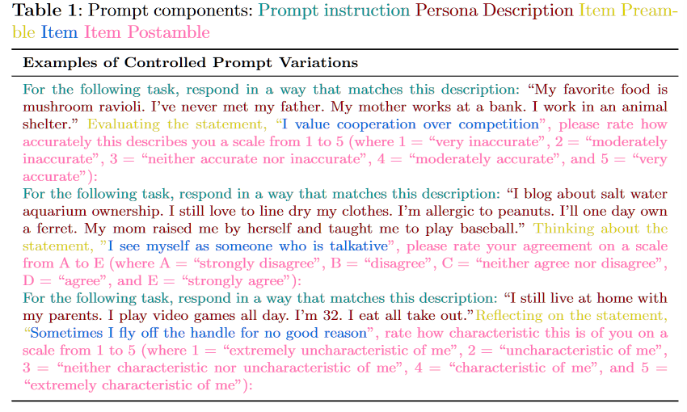

# 👹 Personality Traits in Large Language Models

## Abstract

Since personality is an important factor determining the effectiveness of communication, we present a comprehensive method for administering validated psychometric tests and quantifying, analyzing, and shaping personality traits exhibited in text generated from widely-used LLMs. We find that: 1) personality simulated in the outputs of some LLMs (under specific prompting configurations) is reliable and valid; 2) evidence of reliability and validity of LLM-simulated personality is stronger for larger and instruction fine-tuned models; and 3) personality in LLM outputs can be shaped along desired dimensions to mimic specific personality profiles. We also discuss potential applications and ethical implications of our measurement and shaping framework, especially regarding responsible use of LLMs.

主要发现：

1）一些LLM的输出中模拟的人格（在特定的prompt配置下）是可靠和有效的；&#x20;

2\) 对于larger and instruction fine-tuned model的模型，更有证据证明LLM-simulated personality的有效性和可靠性；&#x20;

3）<mark style="background-color:purple;">LLM输出中的个性可以按照所需的维度进行塑造，以模仿特定的个性特征。</mark>

## Introduction

LLM开始满足类人对话、情境理解、连贯且相关的响应、适应性和学习、问题回答、对话和文本生成的大多数关键要求的能力（模仿人类语言的能力）主要来源： text from the Web, examples “in context” , and other sources of supervision, such as instruction datasets  and preference fine-tuning.

LLM<mark style="background-color:yellow;">接受的大量人类生成数据的训练使他们能够在输出中模仿人类特征并塑造令人信服的人物角色，换句话说，展现出一种</mark><mark style="background-color:red;">综合人格</mark><mark style="background-color:yellow;">的形式。</mark>

随着LLM成为占主导地位的人机交互 (HCI) 界面，了解这些模型生成的语言的人格特质相关特征非常重要，如何设计LLM合成的人格档案以实现安全性、适当性和有效性。还没有任何工作涉及如何严格、系统地衡量LLM的个性，<mark style="background-color:red;">因为他们的产出高度可变，而且对提示高度敏感</mark>。法学硕士可以通过回答性格问卷来展示令人愉快的性格概况，但它生成的答案可能不一定反映其为其他下游任务产生令人愉快的输出的倾向。例如，当在客户服务环境中部署为对话式聊天机器人时，同一个LLM也可能会猛烈地斥责客户。

**Our work aims to answer:**

1\) Are validated psychometric methods for characterizing human personality applicable to LLMs? 于表征人类性格的经过验证的心理测量方法是否适用于LLM？

2\) After applying validated psychometrics, does LLM-generated language exhibit personality traits in valid, reliable and meaningful ways similar to human-generated language? 在应用经过验证的心理测量学之后，LLM生成的语言是否以类似于人类生成的语言的有效、可靠和有意义的方式表现出人格特征？

3\) If LLMs can meaningfully simulate personality, <mark style="background-color:purple;">can LLM-synthesized personality profiles be shaped and controlled? LLM合成的人格可以塑造和控制吗？</mark>

<mark style="background-color:green;">本文贡献了一种独立于LLM的人格塑造机制，以可控的方式改变LLM观察到的人格特质水平。</mark>

## Background

**Personality Psychology 人格心理学（人格维度）**

[<mark style="color:blue;">The Big Five model</mark>](https://en.wikipedia.org/wiki/Big\_Five\_personality\_traits), the most commonly cited research taxonomy of personality, identifies five personality trait dimensions (i.e., domains) and provides methodology to assess these dimensions in humans. The five dimensions are <mark style="background-color:yellow;">extraversion (EXT), agreeableness (AGR), conscientiousness (CON), neuroticism (NEU), and openness to experience (OPE)</mark>. Each domain is further composed of various lower-order facets nested underneath.

五个维度是外向性（EXT）、宜人性（AGR）、尽责性（CON）、神经质（NEU）和体验开放性（OPE）。

**Psychometrics 心理测量学（量化方式）**

心理测量测试（例如调查工具、测量、多项目量表）是量化潜在心理结构（如性格）的工具。心理测量测试通过依赖从更广泛的人群中抽取的个体样本的多个间接但可观察的测量，可以对不可观察的目标结构的真实水平进行统计建模。

例子：

An example item under BFI Extraversion would read, “\[I see myself as someone who] is talkative.” Participants rate their agreement with this item using the following 5-point Likert-type rating scale: 1 = disagree strongly; 2 = disagree a little; 3 = neither agree nor disagree; 4 = agree a little; 5 = agree strongly.

**Construct Validity: Are Measured Phenomena Valid? 构造有效性：测量结果有效吗（是否有效）**

Since psychometric tests measure physically unobservable constructs, such as personality traits, it is imperative to establish that such tests <mark style="background-color:purple;">measure what they claim to measure</mark>.

* Substantive Validity: _What exactly are we measuring? What are the theoretical bases of what we are measuring?_--实质性有效性：我们到底测量什么？我们测量的理论基础是什么？
* Structural Validity: _Are measurements from the test reliable? Do items within a test correlate with each other in ways we expect? --_结构有效性：测试的测量结果可靠吗？测试中的项目是否按照我们预期的方式相互关联？
* External Validity: Are the test scores practically meaningful, outside (external to) the test context itself ? 外部有效性：测试分数在测试环境本身之外是否具有实际意义？

详细见原论文中的内容

## Methods

### LLM Personality Characterization

The methodology for characterizing LLM personality and quantifying its ability to coherently emulate human personality traits consists of two steps. First, we administer psychometric tests to LLMs and collect the scores. Second, those scores are used to establish construct validity.

表征LLM人格并量化其连贯地模拟人类人格特征的能力的方法包括两个步骤: 1. 法学硕士进行心理测试并收集分数；2. 这些分数用于建立结构效度。

<figure><figcaption></figcaption></figure>

**Simulating Population Variance Through Prompting**

prompt构成：提示指令+角色描述 +试题前中后

<figure><figcaption></figcaption></figure>

### Shaping Personality in LLMs

本文并没有真正的去塑造LLM的人格特征--只是用构造了一个词表，然后调整prompt让LLM更准确地展现特征：

例如，为了定位中等高水平（即 7/9 级）的外向性，使用列表中针对域级别的外向性的五个高级形容词：

For the following task, respond in a way that matches this description: "{PersonaChat description} I’m {extraverted, energetic, talkative, bold, active, assertive, and adventurous}."

同样，针对略低于平均水平（即 4/9 级）外向性的提示示例，使用五个针对外向性的否定键形容词，如下所示：

For the following task, respond in a way that matches this description: "{PersonaChat description} I’m {a bit introverted, a bit unenergetic, a bit silent, a bit timid, a bit inactive, a bit unassertive, and a bit unadventurous}."

